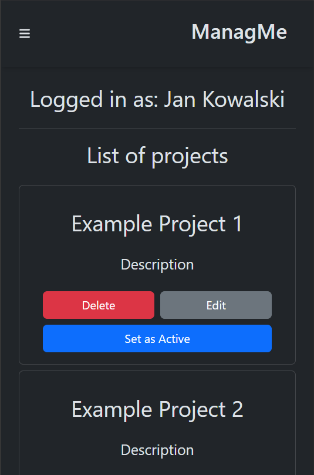

# ManagMe 🗂️

**ManagMe** is a simple Kanban-style project management tool built with React and TypeScript.  
The app allows users to create projects, define user stories, and manage tasks in a clear and organized interface.

---

## 🔧 Tech Stack

- **Frontend:** React, TypeScript, Vite, Tailwind CSS
- **Backend:** Node.js, Express.js
- **Auth:** JWT-based authentication (custom Express server)
- **Testing:** Playwright (basic setup)
- **State Management:** React Context API

---

## ✨ Features

- Project → Story → Task hierarchy
- Create, delete and manage tasks
- Manual login (with predefined roles)
- Google login *(requires API key – see `.env` section)*
- Responsive design
- Dark and light theme (dark by default)

---

## 🚀 Getting Started

### Prerequisites

- Node.js (v18+)
- npm

---

### 📦 Option 1: Install everything manually

```bash
npm install
cd backend && npm install
cd ../express && npm install
```

### ⚡ Option 2: Install all at once

```bash
npm run install:all
```

> This installs dependencies in all three folders.

---

### ▶️ Option 1: Run each part manually

Start the **frontend**:

```bash
npm run dev
```

Start the **backend API**:

```bash
cd backend
npm start
```

Start the **auth/token server**:

```bash
cd express
npm run dev
```

### ⚡ Option 2: Run everything with one command

```bash
npm run start:all
```

> All services must be running at the same time.

---

## 🌐 Environment Variables (`.env`)

To enable Google login, create `.env` files in `/express` and `/frontend` with your Google OAuth credentials.

**These files are not included in the repository.**  
Example:

```env
VITE_GOOGLE_CLIENT_ID=your_client_id
GOOGLE_CLIENT_ID=your_client_id
GOOGLE_CLIENT_SECRET=your_client_secret
```

---

## 👤 Test Users

You can log in using these predefined users:

| Role      | Login     | Password |
|-----------|-----------|----------|
| Admin     | admin     | zaq12wsx |
| Developer | developer | zaq12wsx |
| DevOps    | devops    | zaq12wsx |
| Guest     | guest     | zaq12wsx |

---

## 🧪 Tests

Basic E2E testing is set up with **Playwright**.

The tests cover:

- Logging in with predefined users
- Creating, displaying, editing, and deleting:
  - Projects
  - User stories
  - Tasks
- Updating task status
- Assigning users to tasks
- Navigating between views and switching active projects

To run the tests:

```bash
npx playwright test
```

> Tests check full user flow functionality, including form interactions, routing, and UI updates.

### 🧪 Example test case

**Full flow: login → project → story → tasks (add/edit/delete)**

1. Log in as **admin**
2. Go to **Projects** and create a new project named `TestProject`
3. Set the new project as **active**
4. Add a new **story** with:
   - Title: `TestStory`
   - Description: `test`
   - Priority: `medium`
   - Status: `doing`
5. Navigate to **Tasks**
6. Add two new tasks:
   - First task:
     - Name: `First`, description: `test`, duration: `10`
   - Second task:
     - Name: `Second`, description: `test`, duration: `30`, priority: `high`, assigned to user ID `3`
7. Mark the first task as **done**
8. Open task details and edit:
   - Change name from `First` to `Third`
   - Change assigned user to ID `1`
9. Save changes
10. Delete both tasks
11. Navigate back to **Projects**
12. Change the active project
13. Set the previous project as active again
14. Delete both projects

> ✅ This test checks all core flows: login, project management, story creation, task CRUD, status updates, user assignment and UI navigation.

---

## 📸 Screenshots

  
_Login screen with manual and Google authentication._

  
_Main dashboard showing projects and their structure._

  
_Form for adding a new task._

  
_Mobile version – board view._

  
_Mobile version – nav view._

---

## 🎨 Theme Mode

The app supports both **dark** and **light** modes.  
Dark mode is the default and recommended.  
Theme toggle button is available in the top-right corner of the interface.

---

## 📁 Project Structure

```
├── /               → Frontend (React)
├── /backend        → Backend API (Express)
├── /express        → Auth/JWT server (Google login + tokens)
├── /screenshots    → Images used in README
├── /tests          → Playwright test files
```

---

## 🙋 About the Author

Created by **Jakub Opyd**, an IT student passionate about frontend development and building real-world apps with React and TypeScript.

> GitHub: [github.com/JakubOpydwsei](https://github.com/JakubOpydwsei)  
> Email: jakubopyd@gmail.com

---

## 📄 License

This project is open-source and free to use.
